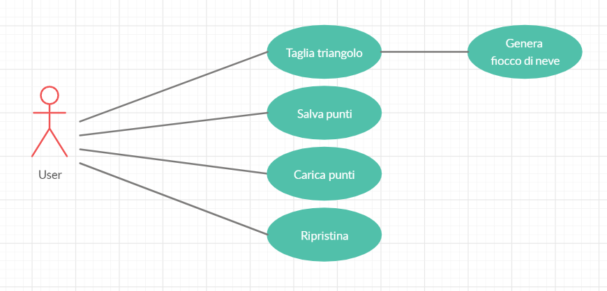
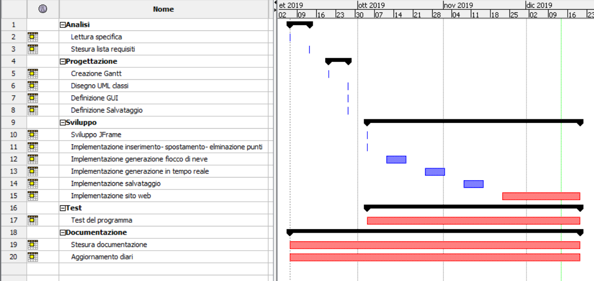
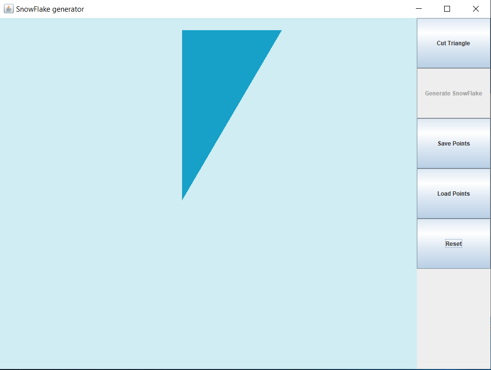
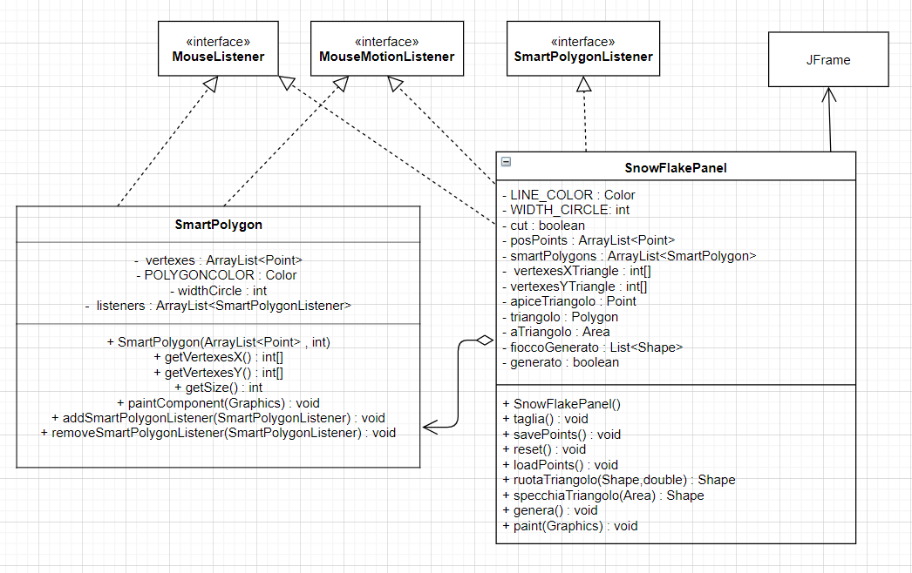
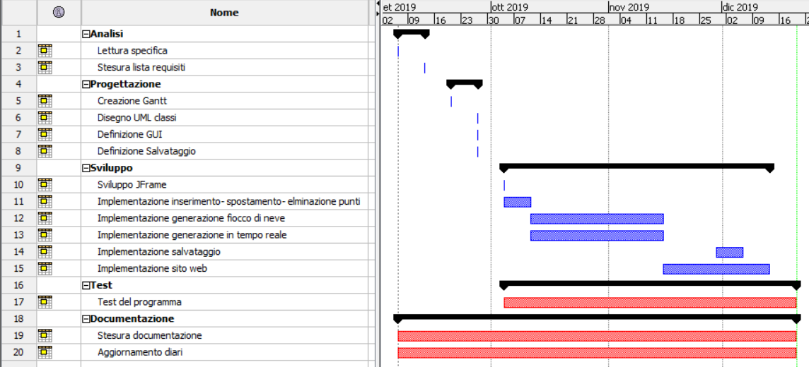

1. [Introduzione](#introduzione)

  - [Informazioni sul progetto](#informazioni-sul-progetto)

  - [Abstract](#abstract)

  - [Scopo](#scopo)

1. [Analisi](#analisi)

  - [Analisi del dominio](#analisi-del-dominio)

  - [Analisi dei mezzi](#analisi-dei-mezzi)

  - [Analisi e specifica dei requisiti](#analisi-e-specifica-dei-requisiti)

  - [Use case](#use-case)

  - [Pianificazione](#pianificazione)

1. [Progettazione](#progettazione)

  - [Design dell’architettura del sistema](#design-dell’architettura-del-sistema)

  - [Design dei dati e database](#design-dei-dati-e-database)

1. [Implementazione](#implementazione)

1. [Test](#test)

  - [Protocollo di test](#protocollo-di-test)

  - [Risultati test](#risultati-test)

  - [Mancanze/limitazioni conosciute](#mancanze/limitazioni-conosciute)

1. [Consuntivo](#consuntivo)

1. [Conclusioni](#conclusioni)

  - [Sviluppi futuri](#sviluppi-futuri)

  - [Considerazioni personali](#considerazioni-personali)

1. [Sitografia](#sitografia)

1. [Allegati](#allegati)

## Introduzione

### Informazioni sul progetto

  Il progetto *Fiocco di neve* è stato realizzato da Adriano Chiriacò alla Scuola Arti e Mestieri a Trevano durante la lezione del modulo 306.

  I docenti responsabili sono:
   -  Luca Muggiasca (luca.muggiasca@edu.ti.ch)
   -  Geo Petrini (geo.petrini@edu.ti.ch)

La data d'inizio del progetto è il 3.09.2019 mentre la fine è prevista per il 20.12.2019.

### Abstract

  Il seguente documento contiene tutte le informazioni riguradrante il progetto *Fiocco di neve*
  e
  E’ una breve e accurata rappresentazione dei contenuti di un documento,
  senza notazioni critiche o valutazioni. Lo scopo di un abstract efficace
  dovrebbe essere quello di far conoscere all’utente il contenuto di base
  di un documento e metterlo nella condizione di decidere se risponde ai
  suoi interessi e se è opportuno il ricorso al documento originale.

  Può contenere alcuni o tutti gli elementi seguenti:

  -   **Background/Situazione iniziale**

  -   **Descrizione del problema e motivazione**: Che problema ho cercato
      di risolvere? Questa sezione dovrebbe includere l'importanza del
      vostro lavoro, la difficoltà dell'area e l'effetto che potrebbe
      avere se portato a termine con successo.

  -   **Approccio/Metodi**: Come ho ottenuto dei progressi? Come ho
      risolto il problema (tecniche…)? Quale è stata l’entità del mio
      lavoro? Che fattori importanti controllo, ignoro o misuro?

  -   **Risultati**: Quale è la risposta? Quali sono i risultati? Quanto è
      più veloce, più sicuro, più economico o in qualche altro aspetto
      migliore di altri prodotti/soluzioni?

  Esempio di abstract:

  > *In this document you can find all information about my project
  > you can find the explain of my implemention, my testcases and more information*

### Scopo

  Lo scopo di questo progetto è quello di imparare a gestire un progetto con
  tutti gli strumenti ausiliari.

## Analisi

### Analisi del dominio

  Il progetto fiocco di neve verrà sviluppato per uno scopo scolastico per far
  capire come si gestisce un progetto.
  Come progetto è stato scelto un programma nel quale si può ritagliare un
  triangolo a piacimento e da questo verrà generato un fiocco di neve.

### Analisi e specifica dei requisiti

  |**ID**	|**Nome**			|**Priorità**|**Vers**|**Note**  |
  |----|------------|--------|----|------|
  |Req-01|L'applicativo deve essere scritto in java|1|1.0|...|
  |Req-02|Deve esistere sito con descrizione software|1|1.0|...|
  |Req-04|Deve essere possibile scaricare il software|1|1.0|...|
  |Req-05|I tagli del triangolo devono poter essere fatti con il mouse|1|1.0|...|
  |Req-06|Deve esserci un'interfaccia grafica|1|1.0|...|
  |Req-07|L'area di lavoro deve essere un triangolo|1|1.0|...|
  |Req-08|Deve essere possibile resettare i punti registrati|1|1.0|...|
  |Req-09|Deve esistere il tasto genera fiocco|1|1.0|...|
  |Req-10|La generazione deve avvenire in tempo reale|2|1.0|...|
  |Req-11|I punti devono poter essere spostati|2|1.0|...|
  |Req-12|I punti devono poter essere rimossi|2|1.0|...|
  |Req-13|Il lavoro deve poter essere salvato|1|1.0|...|
  |Req-14|Il salvataggio deve essere fatto in formato PNG o SVG|1|1.0|...|
  |Req-15|Il salvataggio deve avere dimensioni definite dall'utente|1|1.0|...|
  |Req-16|Deve essere possibile salvare i punti di taglio|1|1.0|...|
  |Req-17|La finestra deve essere ridimensionabile|1|1.0|...|
  |Req-18|Le dimensioni minime della finestra è di 1024x768|1|1.0|...|
  |Req-19|I colori del sito devono essere adatti anche a persone con problemi di daltonismo|1|1.0|...|
  |Req-20|Il sito deve avere la lista dei requisiti di sistema minimi, la JRE e una guida con screenshots|1|1.0|...|
  |Req-21|Si possono avere più poligoni di taglio|1|1.0|...|
  |Req-22|L'applicativo dev essere fornito tramita jar.|1|1.0|...|

### Use case

### Pianificazione

### Analisi dei mezzi

I mezzi utilizzati per sviluppare questo progetto sono java, che è anche il
linguaggio in cui è stato scritto il programma e Netbeans che è la piattaforma
che ho utilizzato per la stesura del codice.

## Progettazione

Il primo passaggio da realizzare è la stesura del Gantt preventivo. Dopo fatto
ciò inizierò a schizzare una bozza dell'UML del mio programma e inizerò a fare delle
ricerche sui metodi che mi saranno utili durante la scrittura del codice.
Dopo aver fatto ciò inizierò a sviluppare le classi.
Quando finalment le classi saranno solide implementerò l'interfaccia grafica e
cercherô di ottenere il prodotto finale.
Una volta finito il programma verificherò che tutti i requisiti siano stati
soddisfatti e da lì in poi inizierà lo sviluppo del sito web.
Per quanto riguarda la pagine web prima di scrivere il codice abbozero un diesgno del sito sulla carta
e poi cercherò su internet dei bootstrap che mi permetteranno di realizzarlo.
L'ultimo passaggio sarà quello di pubblicare il prodotto online.

### Design dell’architettura del sistema

L'architettura è composta da quattro classi:
- SmartPolygon
- SmartPolygonListener
- SnowFlakePanel
- SnowFlakeForm

### Design delle interfacce

Questa è la mia interfaccia grafica:

### Design procedurale

## Implementazione

Il programma è stato sviluppato con 4 classi.
La classe principale è SnowFlakePanel, in questo pannello si eseguono tutte le operazioni
sul triangolo e si può generare il fiocco. Quando si taglia il triangolo si creano dei poligoni che
sono oggetti SmartPolygon. Questi poligoni sono definiti smart perchè grazie all'interface SmartPolygonListener
generano degli eventi quando viene eliminato un vertice o spostato. C'è anche un form principale dove ci sono dei bottoni che permettono di interagire con il triangolo.

## Test

### Protocollo di test

|Test Case      | TC-001                               |
|---------------|--------------------------------------|
|**Nome**       |Taglio triangolo |
|**Riferimento**|REQ-05                               |
|**Descrizione**|Deve essere possibile tagliare il triangolo utilizzando il mouse. |
|**Prerequisiti**||
|**Procedura**     |Avviare l'applicazione fare click con il tasto sinistro sopra al triangolo. |
|**Risultati attesi** |Si creano dei punti che definiscono il poligono di taglio |

|Test Case      | TC-002                               |
|---------------|--------------------------------------|
|**Nome**       |Spostamento punti |
|**Riferimento**|REQ-11                               |
|**Descrizione**|Deve essere possibile spostare i punti. |
|**Prerequisiti**|Aver creato un poligono di taglio|
|**Procedura**     |Tenere premuto con il tasto sinistro su un punto e trascinare nella posizione in cui si vuole spostare|
|**Risultati attesi** |Il punto si sposta dove viene trascinato|

|Test Case      | TC-003                               |
|---------------|--------------------------------------|
|**Nome**       |Eliminazione punti|
|**Riferimento**|REQ-12                               |
|**Descrizione**|Deve essere possibile rimuovere i punti. |
|**Prerequisiti**|Aver creato un poligono di taglio|
|**Procedura**     |Premere con il tasto destro su un punto che si vuole eliminare|
|**Risultati attesi** |Il punto si elimina|

|Test Case      | TC-004                               |
|---------------|--------------------------------------|
|**Nome**       |Moltitudie poligoni di taglio|
|**Riferimento**|REQ-21                              |
|**Descrizione**|Deve essere possibile creare più poligoni di taglio. |
|**Prerequisiti**|Aver creato un poligono di taglio|
|**Procedura**     |Creare un altro poligono di taglio dopo aver chiuso quello precedente.|
|**Risultati attesi** |I due poligoni di taglio coesistono e sono indipendenti tra loro|

|Test Case      | TC-005                               |
|---------------|--------------------------------------|
|**Nome**       |Ridimensionabiltà della finestra|
|**Riferimento**|REQ-17                              |
|**Descrizione**|La finestra del programma deve essere ridimensionabile. |
|**Prerequisiti**|-|
|**Procedura**     |Avviare il programma e posizionarsi su un lato della finestra e provare a ridimensionare trascinando col mouse|
|**Risultati attesi** |La finestra si ridimensiona|

|Test Case      | TC-006                               |
|---------------|--------------------------------------|
|**Nome**       |Salvataggio lavoro|
|**Riferimento**|REQ-13                              |
|**Descrizione**|Il lavoro deve poter essere salvato e ricaricato.|
|**Prerequisiti**|Aver generato un fiocco o creato dei poligoni di taglio.|
|**Procedura**     |Cliccare su salva punti, dare un nome al file e salvarlo. Cliccare su reset. Cliccare su "Load points" e selezionare il file salvato in precedenza.|
|**Risultati attesi** |Vengono ricaricati i punti creati in precedenza.|

### Risultati test

Tabella riassuntiva in cui si inseriscono i test riusciti e non del
prodotto finale. Se un test non riesce e viene corretto l’errore, questo
dovrà risultare nel documento finale come riuscito (la procedura della
correzione apparirà nel diario), altrimenti dovrà essere descritto
l’errore con eventuali ipotesi di correzione.

### Mancanze/limitazioni conosciute

Mancanze:
- Nel software non sono state implmentate le funzionalità di esportazione delle immagini in PNG e SVG.

## Consuntivo

Come si può notare dal gantt il risultato finale di è stato diverso rispetto la progettazione iniziale,
questo principalmente perchè avevo sottovalutato la durata del tempo della generazione del fiocco.

## Conclusioni

A termine progetto posso affermare che sono soddisfatto del lavoro
che ho fatto e penso che mi sia stato utile per quanto riguarda la mia formazione. La progettazione non è andata
male e la realizzazione del progetto è stata buona. Grazie a questo progetto ho capito che devo essere più preciso
nella progettazione del Gantt sopratutto per quanto riguarda le attività.

### Considerazioni personali
  Con questo progetto ho allenato le mie doti nel gestire un progetto.

## Allegati
-   Diari di lavoro
